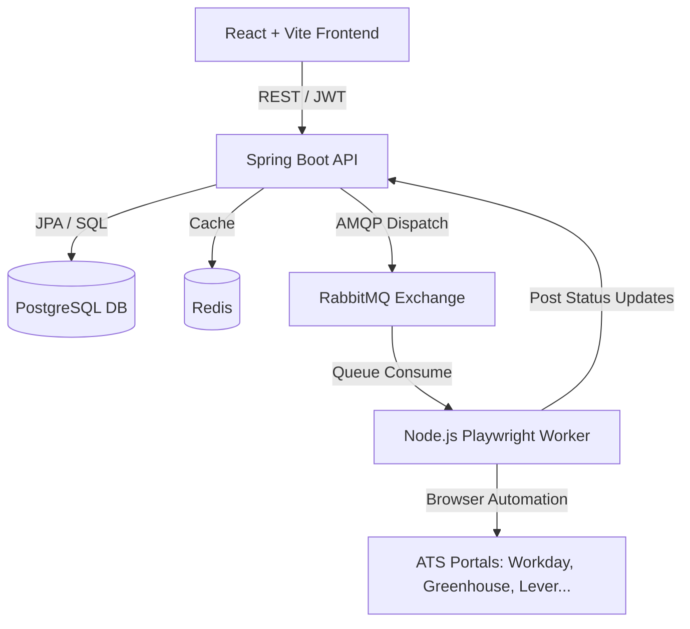

# JobPilot Microservices Architecture Specification

## Architecture Overview

## ATS Adapters Matrix

| ATS Provider | Adapter Name | Multi-Page Form Support | Security Trigger Handling |
| :--- | :--- | :--- | :--- |
| Greenhouse | `GreenhouseAdapter` | Yes | Pauses on CAPTCHA / MFA |
| Lever | `LeverAdapter` | Single-page POST | Form filled, pauses before Submit |
| Workday | `WorkdayAdapter` | Multi-step portal | Detects authentication barrier |
| Ashby | `AshbyAdapter` | React Form filler | Heuristic fill + screenshot |
| Oracle Recruiting | `OracleAdapter` | Enterprise multi-tab | Pause-before-submit |
| SAP SuccessFactors | `SuccessFactorsAdapter`| Multi-step enterprise | Pause-before-submit |
| SmartRecruiters | `SmartRecruitersAdapter`| API & Form | Heuristic fill |
| iCIMS | `IcimsAdapter` | iFrame forms | Heuristic fill |
| Custom | `CustomAdapter` | Generic DOM heuristic | Attribute & Label matching |
