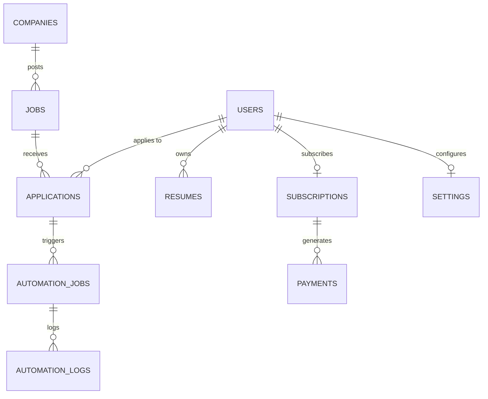

# Database ER Diagram & Data Model

## PostgreSQL Entity-Relationship Schema

## Flyway Migration Table Structure

- `users`: Core authentication profiles, OAuth IDs, contact details, experience, skills.
- `companies`: Company metadata, career URLs, default ATS type.
- `jobs`: Discovered job postings, URLs, experience requirements, salary ranges.
- `applications`: Application status state machine, match scores, reasons, screenshots.
- `resumes`: User uploaded resume versions and keyword tags.
- `subscriptions`: Premium annual status (₹999/yr), gateway IDs, expiration dates.
- `payments`: Razorpay/Stripe transactions, invoice URLs, GST details.
- `settings`: Configured matching criteria, min/max exp, inclusion/exclusion keywords.
- `automation_jobs`: RabbitMQ execution tracking and retry counts.
- `automation_logs`: Playwright step-by-step logs and screenshot URLs.
